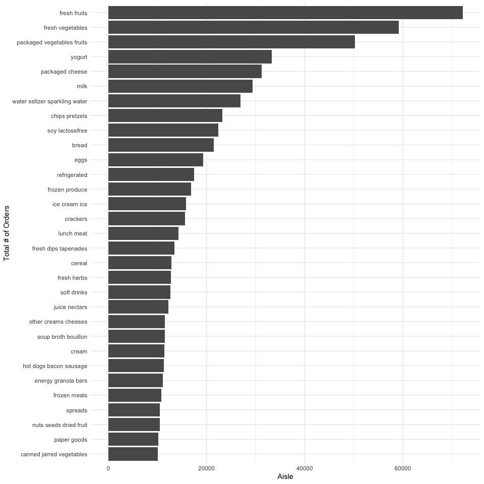
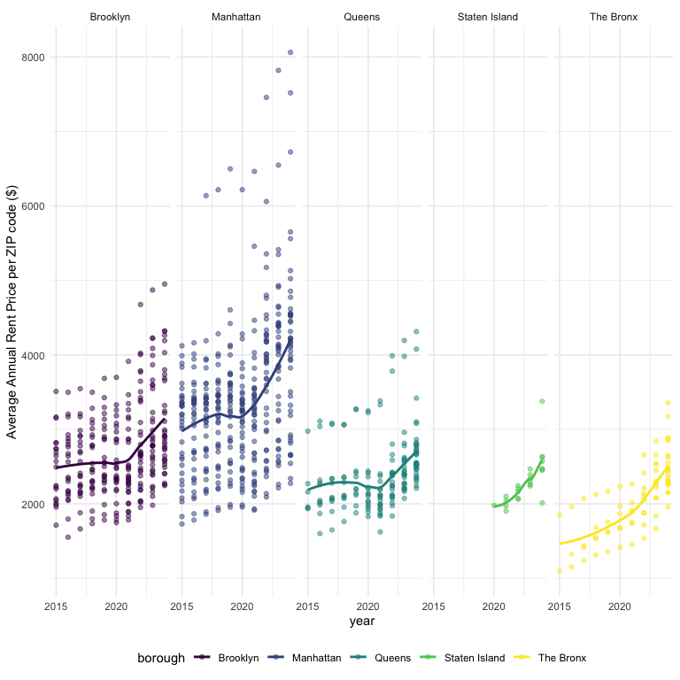

p8105_hw3_sc5826
================
Shivalika Chavan
2025-10-03

``` r
library(tidyverse)
## ── Attaching core tidyverse packages ──────────────────────── tidyverse 2.0.0 ──
## ✔ dplyr     1.1.4     ✔ readr     2.1.5
## ✔ forcats   1.0.0     ✔ stringr   1.5.1
## ✔ ggplot2   3.5.2     ✔ tibble    3.3.0
## ✔ lubridate 1.9.4     ✔ tidyr     1.3.1
## ✔ purrr     1.1.0     
## ── Conflicts ────────────────────────────────────────── tidyverse_conflicts() ──
## ✖ dplyr::filter() masks stats::filter()
## ✖ dplyr::lag()    masks stats::lag()
## ℹ Use the conflicted package (<http://conflicted.r-lib.org/>) to force all conflicts to become errors
library(haven)
library(readxl)
library(ggridges)
library(p8105.datasets)


knitr::opts_chunk$set(
  fig.width = 8,
  fig.asp = 1,
  out.width = "95%"
)

theme_set(theme_minimal() + theme(legend.position = "bottom"))

options(
  ggplot2.continuous.colour = "viridis",
  ggplot2.continuous.fill = "viridis"
)

scale_colour_discrete = scale_colour_viridis_d
scale_fill_discrete = scale_fill_viridis_d

# order of levels for making month into a factor so the months are in chronological order, not alphabetical
month_order = c("January","February","March","April","May","June","July","August","September","October","November","December") 
```

### Problem 1

``` r
data("instacart") 
instacart = instacart |> 
  relocate(
    user_id, 
    order_id, order_number, days_since_prior_order, order_dow, order_hour_of_day, 
    add_to_cart_order, product_id, product_name, reordered, 
    department_id, department, aisle_id, aisle
  ) |> 
  select(-eval_set)
```

In the `instacart` data set, there are 1384617 observations and 14
variables (user_id, order_id, order_number, days_since_prior_order,
order_dow, order_hour_of_day, add_to_cart_order, product_id,
product_name, reordered, department_id, department, aisle_id, aisle).
The data set has been arranged as such:

- A user identifier: `user_id`
- Information about the order: `order_id`,`order_number` (order sequence
  number for this user), `days_since_prior_order`, and when the order
  was placed (`order_dow` and `order_hour_of_day`)
- Information about the products added to the cart: `add_to_cart_order`,
  `product_id`, `product_name`, `reordered` (1 if this prodcut has been
  ordered by this user in the past, 0 otherwise), `department_id`,
  `department`, `aisle_id`, `aisle`

There also was an `eval_set` variable. Every observation was from the
`train` set, which isn’t relevant to this data exploration.

Here’s an example of one user’s order:

| user_id | order_id | order_number | days_since_prior_order | order_dow | order_hour_of_day | add_to_cart_order | product_id | product_name | reordered | department_id | department | aisle_id | aisle |
|---:|---:|---:|---:|---:|---:|---:|---:|:---|---:|---:|:---|---:|:---|
| 112108 | 1 | 4 | 9 | 4 | 10 | 1 | 49302 | Bulgarian Yogurt | 1 | 16 | dairy eggs | 120 | yogurt |
| 112108 | 1 | 4 | 9 | 4 | 10 | 2 | 11109 | Organic 4% Milk Fat Whole Milk Cottage Cheese | 1 | 16 | dairy eggs | 108 | other creams cheeses |
| 112108 | 1 | 4 | 9 | 4 | 10 | 3 | 10246 | Organic Celery Hearts | 0 | 4 | produce | 83 | fresh vegetables |
| 112108 | 1 | 4 | 9 | 4 | 10 | 4 | 49683 | Cucumber Kirby | 0 | 4 | produce | 83 | fresh vegetables |
| 112108 | 1 | 4 | 9 | 4 | 10 | 5 | 43633 | Lightly Smoked Sardines in Olive Oil | 1 | 15 | canned goods | 95 | canned meat seafood |
| 112108 | 1 | 4 | 9 | 4 | 10 | 6 | 13176 | Bag of Organic Bananas | 0 | 4 | produce | 24 | fresh fruits |
| 112108 | 1 | 4 | 9 | 4 | 10 | 7 | 47209 | Organic Hass Avocado | 0 | 4 | produce | 24 | fresh fruits |
| 112108 | 1 | 4 | 9 | 4 | 10 | 8 | 22035 | Organic Whole String Cheese | 1 | 16 | dairy eggs | 21 | packaged cheese |

User 112108 has `order_id` 1, which is the 4th order from this user.
It’s been 9 days since their last order. This order was placed on the
4th day of the week and 10th hour of the day. There were 8 products
added to this order (Bulgarian Yogurt, Organic 4% Milk Fat Whole Milk
Cottage Cheese, Organic Celery Hearts, Cucumber Kirby, Lightly Smoked
Sardines in Olive Oil, Bag of Organic Bananas, Organic Hass Avocado,
Organic Whole String Cheese), from the 3 departments (dairy eggs,
produce, canned goods) and 6 aisles (yogurt, other creams cheeses, fresh
vegetables, canned meat seafood, fresh fruits, packaged cheese).

``` r
length(unique(pull(instacart, aisle_id)))
## [1] 134
length(unique(pull(instacart, aisle)))
## [1] 134

top_3_ordered_aisles = instacart |> 
  group_by(aisle) |> 
  summarize(num_orders = n_distinct(order_id)) |> 
  mutate(order_rank = min_rank(desc(num_orders))) |> 
  filter(order_rank <= 3) 
```

There are 134 aisles. The 3 aisles with the highest number of orders are
fresh fruits, fresh vegetables, packaged vegetables fruits.

``` r
# Plotting 
instacart |> 
  group_by(aisle) |> 
  summarize(num_orders = n_distinct(order_id)) |> 
  filter(num_orders > 10000) |> 
  arrange(num_orders) |> 
  ggplot(aes(x = reorder(aisle, num_orders), y = num_orders)) +
  geom_bar(stat = "identity") +
  coord_flip() +
  labs(
    x = "Total # of Orders",
    y = "Aisle"
  )
```



``` r
instacart |>
  filter(aisle %in% c("baking ingredients", "dog food care", "packaged vegetables fruits")) |> 
  group_by(aisle, product_name) |> 
  summarize(num_orders = n()) |> 
  mutate(order_rank = min_rank(desc(num_orders))) |> 
  filter(order_rank <= 3) |> 
  arrange(desc(num_orders)) |> 
  select(-order_rank) |> 
  knitr::kable()
## `summarise()` has grouped output by 'aisle'. You can override using the
## `.groups` argument.
```

| aisle | product_name | num_orders |
|:---|:---|---:|
| packaged vegetables fruits | Organic Baby Spinach | 9784 |
| packaged vegetables fruits | Organic Raspberries | 5546 |
| packaged vegetables fruits | Organic Blueberries | 4966 |
| baking ingredients | Light Brown Sugar | 499 |
| baking ingredients | Pure Baking Soda | 387 |
| baking ingredients | Cane Sugar | 336 |
| dog food care | Snack Sticks Chicken & Rice Recipe Dog Treats | 30 |
| dog food care | Organix Chicken & Brown Rice Recipe | 28 |
| dog food care | Small Dog Biscuits | 26 |

``` r
instacart |> 
  filter(product_name %in% c("Pink Lady Apples", "Coffee Ice Cream")) |> 
  group_by(product_name, order_dow) |> 
  summarize(mean_hour_of_day = round(mean(order_hour_of_day), digits = 1)) |> 
  pivot_wider(
    names_from = product_name,
    values_from = mean_hour_of_day
  )|> 
  knitr::kable()
## `summarise()` has grouped output by 'product_name'. You can override using the
## `.groups` argument.
```

| order_dow | Coffee Ice Cream | Pink Lady Apples |
|----------:|-----------------:|-----------------:|
|         0 |             13.8 |             13.4 |
|         1 |             14.3 |             11.4 |
|         2 |             15.4 |             11.7 |
|         3 |             15.3 |             14.2 |
|         4 |             15.2 |             11.6 |
|         5 |             12.3 |             12.8 |
|         6 |             13.8 |             11.9 |

### Problem 2

``` r
# Importing and cleaning Zillow data in the same way as HW 2
zip_codes_nyc = read.csv("./data/zillow_data/zip_codes.csv") |> 
  janitor::clean_names()|> 
  select(-state_fips, -file_date) |> 
  relocate(county_code, county_fips, county)

zori_nyc = read.csv("./data/zillow_data/Zip_zori_uc_sfrcondomfr_sm_month_NYC.csv") |>
  janitor::clean_names() |>
  pivot_longer(
    x2015_01_31:x2024_08_31,
    names_to = "date",
    names_prefix = "x",
    values_to = "index"
  ) |>
  separate("date", into = c("year", "month", "day"), sep = "_", convert = TRUE) |>
  mutate(
    month =
      recode(
        month,
        `1` = "January",
        `2` = "February",
        `3` = "March",
        `4` = "April",
        `5` = "May",
        `6` = "June",
        `7` = "July",
        `8` = "August",
        `9` = "September",
        `10` = "October",
        `11` = "November",
        `12` = "December"
        ),
    month = factor(month, levels = month_order),
    county = str_replace(county_name, " County", ""),
    zip_code = region_name
  ) |>
  select(-county_name, -region_type, -region_name, -state_name, -state, -city, -metro) |> 
  relocate(year, month, day, county, zip_code, region_id, size_rank, index)

zori_nyc_neighborhoods = left_join(zori_nyc, zip_codes_nyc, by = c("zip_code", "county")) |> 
  relocate(year, month, day, county, county_code, county_fips, neighborhood, size_rank, region_id, zip_code) |> 
  arrange(year, month, day)
```

There are 116 months between January 2015 and August 2024. How many ZIP
codes are observed 116 times? How many are observed fewer than 10 times?
Why are some ZIP codes are observed rarely and others observed in each
month?

``` r
num_zip_codes = zori_nyc_neighborhoods |> 
  group_by(county, neighborhood, zip_code) |> 
  summarize(
    n_obs = n_distinct(index)
  )
## `summarise()` has grouped output by 'county', 'neighborhood'. You can override
## using the `.groups` argument.

zip_codes_116_obs = num_zip_codes |> 
  filter(n_obs == 116) 

zip_codes_rare_obs = num_zip_codes |> 
  filter(n_obs < 10) 
```

There are 53 zip codes that are observed 116 times. There are 24 zip
codes that are observed less than 10 times. The frequently observed zip
codes have more rental properties (e.g Borough Park, Bushwick and
Williamsburg, Central Brooklyn). The rarely observed zip codes have more
owner-occupied and commercial properties (e.g Central Bronx, High Bridge
and Morrisania, Hunts Point and Mott Haven).

Average rent price year-to-year:

``` r
zori_nyc_neighborhoods |> 
  mutate(
    borough = case_match(
      county,
      "Bronx" ~ "The Bronx",
      "Kings" ~ "Brooklyn",
      "New York" ~ "Manhattan",
      "Queens" ~ "Queens",
      "Richmond" ~ "Staten Island"
      )
    ) |> 
  group_by(borough, year) |> 
  summarize(
    avg_rent_price = round(mean(index, na.rm=TRUE), digits = 2)
  ) |> 
  pivot_wider(
    names_from = borough,
    values_from = avg_rent_price
  ) |> 
  knitr::kable()
## `summarise()` has grouped output by 'borough'. You can override using the
## `.groups` argument.
```

| year | Brooklyn | Manhattan |  Queens | Staten Island | The Bronx |
|-----:|---------:|----------:|--------:|--------------:|----------:|
| 2015 |  2492.93 |   3022.04 | 2214.71 |           NaN |   1759.60 |
| 2016 |  2520.36 |   3038.82 | 2271.96 |           NaN |   1520.19 |
| 2017 |  2545.83 |   3133.85 | 2263.30 |           NaN |   1543.60 |
| 2018 |  2547.29 |   3183.70 | 2291.92 |           NaN |   1639.43 |
| 2019 |  2630.50 |   3310.41 | 2387.82 |           NaN |   1705.59 |
| 2020 |  2555.05 |   3106.52 | 2315.63 |       1977.61 |   1811.44 |
| 2021 |  2549.89 |   3136.63 | 2210.79 |       2045.43 |   1857.78 |
| 2022 |  2868.20 |   3778.37 | 2406.04 |       2147.44 |   2054.27 |
| 2023 |  3015.18 |   3932.61 | 2561.62 |       2332.93 |   2285.46 |
| 2024 |  3126.80 |   4078.44 | 2694.02 |       2536.44 |   2496.90 |

Change in average rent price year-over-year:

| year | Brooklyn | Manhattan |  Queens | Staten Island | The Bronx |
|-----:|---------:|----------:|--------:|--------------:|----------:|
| 2015 |       NA |        NA |      NA |            NA |        NA |
| 2016 |    27.43 |     16.78 |   57.25 |           NaN |   -239.41 |
| 2017 |    25.47 |     95.03 |   -8.66 |           NaN |     23.41 |
| 2018 |     1.46 |     49.85 |   28.62 |           NaN |     95.83 |
| 2019 |    83.21 |    126.71 |   95.90 |           NaN |     66.16 |
| 2020 |   -75.45 |   -203.89 |  -72.19 |           NaN |    105.85 |
| 2021 |    -5.16 |     30.11 | -104.84 |         67.82 |     46.34 |
| 2022 |   318.31 |    641.74 |  195.25 |        102.01 |    196.49 |
| 2023 |   146.98 |    154.24 |  155.58 |        185.49 |    231.19 |
| 2024 |   111.62 |    145.83 |  132.40 |        203.51 |    211.44 |

Collection of rental data in Staten Island only started in 2020. In
general, the most expensive boroughs are Manhattan and Brooklyn. In
2020, presumably because of the COVID-19 pandemic, average rental prices
dropped in Brooklyn, Manhattan, and Queens, but rose in The Bronx. In
2021, average rental price dropped in Brooklyn and Queens, but rose in
Manhattan, Staten Island, and The Bronx. In 2022, average rental prices
shot up in every borough, and have continued to rise in subsequent
years.

Make a plot showing NYC Rental Prices within ZIP codes for all available
years. Your plot should facilitate comparisons across boroughs. Comment
on any significant elements of this plot.

``` r
zori_nyc_neighborhoods |> 
  mutate(
    borough = case_match(
      county,
      "Bronx" ~ "The Bronx",
      "Kings" ~ "Brooklyn",
      "New York" ~ "Manhattan",
      "Queens" ~ "Queens",
      "Richmond" ~ "Staten Island"
      )
    ) |> 
  filter(!is.na(index)) |> 
  ggplot(aes(x = year, y = index, color = borough)) +
  geom_jitter(height = 0, width = 0.2) +
  # geom_smooth(method = "lm", stat = "smooth") +
  facet_grid(.~borough) +
  scale_x_continuous(
    breaks = c(2015, 2020)
  ) 
```



### Problem 3
