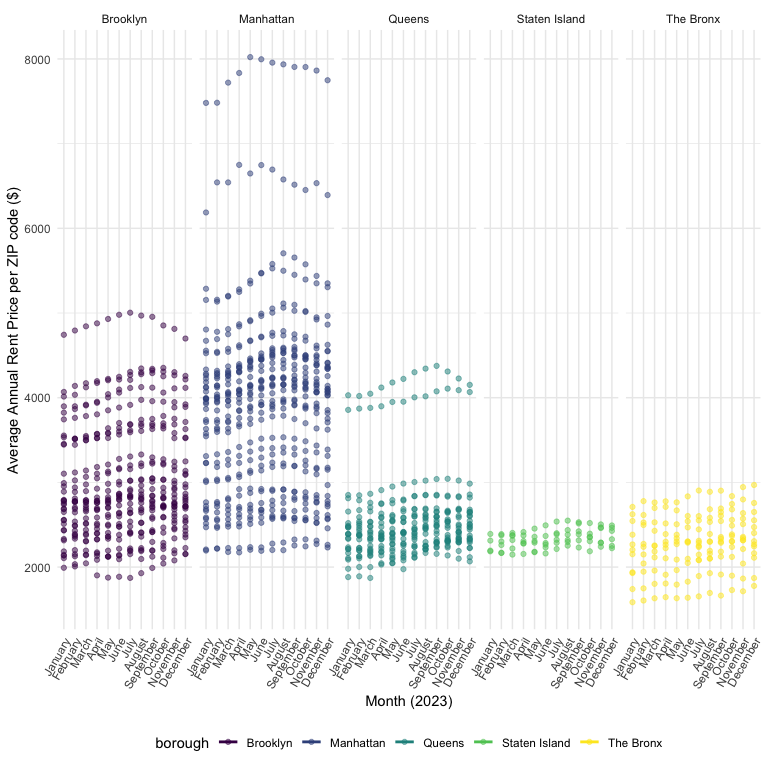
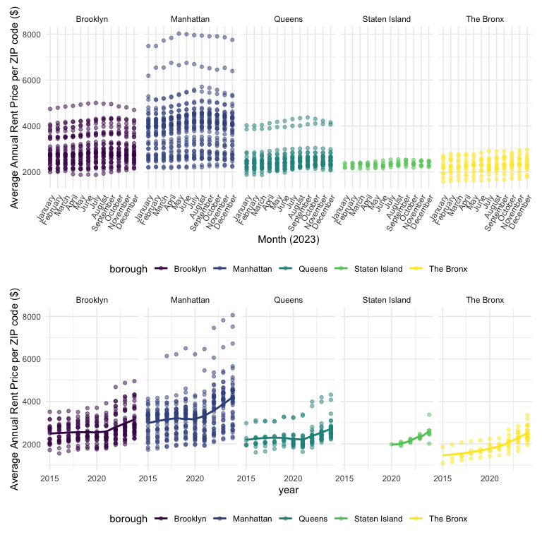
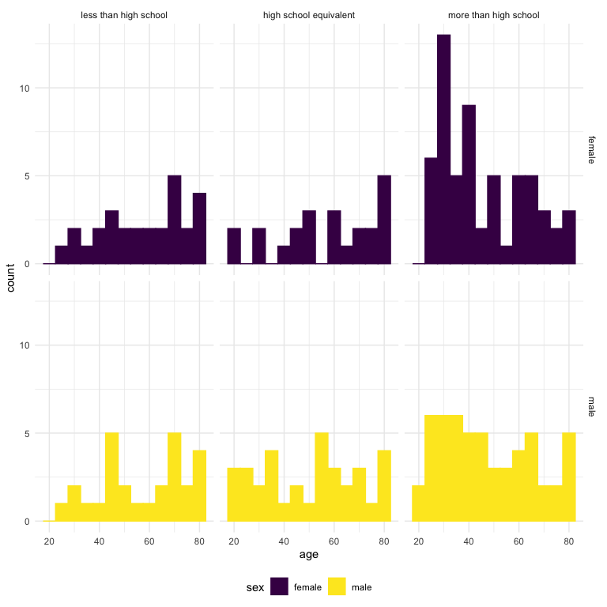
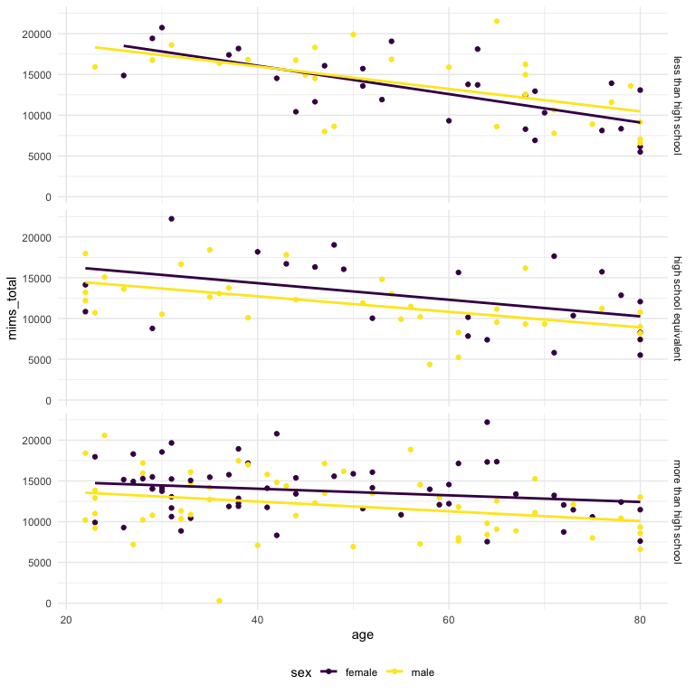
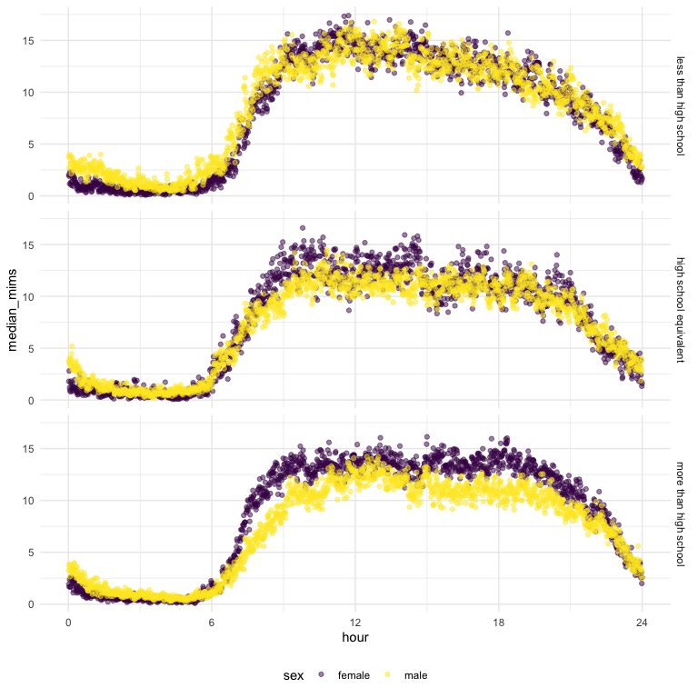
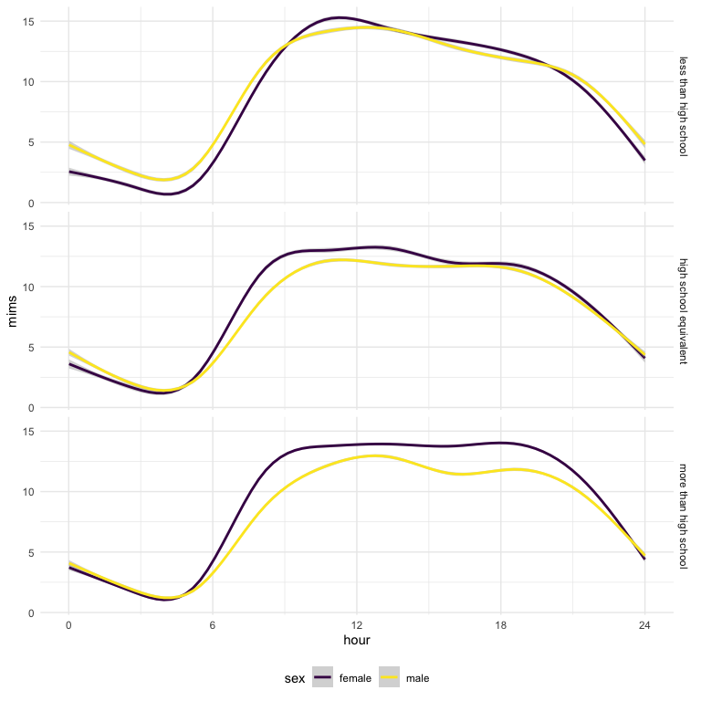

p8105_hw3_sc5826
================
Shivalika Chavan
2025-10-03

``` r
library(tidyverse)
## ── Attaching core tidyverse packages ──────────────────────── tidyverse 2.0.0 ──
## ✔ dplyr     1.1.4     ✔ readr     2.1.5
## ✔ forcats   1.0.0     ✔ stringr   1.5.1
## ✔ ggplot2   3.5.2     ✔ tibble    3.3.0
## ✔ lubridate 1.9.4     ✔ tidyr     1.3.1
## ✔ purrr     1.1.0     
## ── Conflicts ────────────────────────────────────────── tidyverse_conflicts() ──
## ✖ dplyr::filter() masks stats::filter()
## ✖ dplyr::lag()    masks stats::lag()
## ℹ Use the conflicted package (<http://conflicted.r-lib.org/>) to force all conflicts to become errors
library(haven)
library(patchwork)
library(ggridges)
library(p8105.datasets)

knitr::opts_chunk$set(
  fig.width = 8,
  fig.asp = 1,
  out.width = "95%"
)

theme_set(theme_minimal() + theme(legend.position = "bottom"))

options(
  ggplot2.continuous.colour = "viridis",
  ggplot2.continuous.fill = "viridis"
)

scale_colour_discrete = scale_colour_viridis_d
scale_fill_discrete = scale_fill_viridis_d

# order of levels for making month into a factor so the months are in chronological order, not alphabetical
month_order = c("January","February","March","April","May","June","July","August","September","October","November","December") 
```

### Problem 1

``` r
data("instacart") 
instacart = instacart |> 
  relocate(
    user_id, 
    order_id, order_number, days_since_prior_order, order_dow, order_hour_of_day, 
    add_to_cart_order, product_id, product_name, reordered, 
    department_id, department, aisle_id, aisle
  ) |> 
  select(-eval_set)
```

In the `instacart` data set, there are 1384617 observations and 14
variables (user_id, order_id, order_number, days_since_prior_order,
order_dow, order_hour_of_day, add_to_cart_order, product_id,
product_name, reordered, department_id, department, aisle_id, aisle).
The data set has been arranged as such:

- A user identifier: `user_id`
- Information about the order: `order_id`,`order_number` (order sequence
  number for this user), `days_since_prior_order`, and when the order
  was placed (`order_dow` and `order_hour_of_day`)
- Information about the products added to the cart: `add_to_cart_order`,
  `product_id`, `product_name`, `reordered` (1 if this prodcut has been
  ordered by this user in the past, 0 otherwise), `department_id`,
  `department`, `aisle_id`, `aisle`

There also was an `eval_set` variable. Every observation was from the
`train` set, which isn’t relevant to this data exploration.

Here’s an example of one user’s order:

| user_id | order_id | order_number | days_since_prior_order | order_dow | order_hour_of_day | add_to_cart_order | product_id | product_name | reordered | department_id | department | aisle_id | aisle |
|---:|---:|---:|---:|---:|---:|---:|---:|:---|---:|---:|:---|---:|:---|
| 112108 | 1 | 4 | 9 | 4 | 10 | 1 | 49302 | Bulgarian Yogurt | 1 | 16 | dairy eggs | 120 | yogurt |
| 112108 | 1 | 4 | 9 | 4 | 10 | 2 | 11109 | Organic 4% Milk Fat Whole Milk Cottage Cheese | 1 | 16 | dairy eggs | 108 | other creams cheeses |
| 112108 | 1 | 4 | 9 | 4 | 10 | 3 | 10246 | Organic Celery Hearts | 0 | 4 | produce | 83 | fresh vegetables |
| 112108 | 1 | 4 | 9 | 4 | 10 | 4 | 49683 | Cucumber Kirby | 0 | 4 | produce | 83 | fresh vegetables |
| 112108 | 1 | 4 | 9 | 4 | 10 | 5 | 43633 | Lightly Smoked Sardines in Olive Oil | 1 | 15 | canned goods | 95 | canned meat seafood |
| 112108 | 1 | 4 | 9 | 4 | 10 | 6 | 13176 | Bag of Organic Bananas | 0 | 4 | produce | 24 | fresh fruits |
| 112108 | 1 | 4 | 9 | 4 | 10 | 7 | 47209 | Organic Hass Avocado | 0 | 4 | produce | 24 | fresh fruits |
| 112108 | 1 | 4 | 9 | 4 | 10 | 8 | 22035 | Organic Whole String Cheese | 1 | 16 | dairy eggs | 21 | packaged cheese |

User 112108 has `order_id` 1, which is the 4th order from this user.
It’s been 9 days since their last order. This order was placed on the
4th day of the week and 10th hour of the day. There were 8 products
added to this order (Bulgarian Yogurt, Organic 4% Milk Fat Whole Milk
Cottage Cheese, Organic Celery Hearts, Cucumber Kirby, Lightly Smoked
Sardines in Olive Oil, Bag of Organic Bananas, Organic Hass Avocado,
Organic Whole String Cheese), from the 3 departments (dairy eggs,
produce, canned goods) and 6 aisles (yogurt, other creams cheeses, fresh
vegetables, canned meat seafood, fresh fruits, packaged cheese).

``` r
length(unique(pull(instacart, aisle_id)))
## [1] 134
length(unique(pull(instacart, aisle)))
## [1] 134

top_3_ordered_aisles = instacart |> 
  group_by(aisle) |> 
  summarize(num_orders = n_distinct(order_id)) |> 
  mutate(order_rank = min_rank(desc(num_orders))) |> 
  filter(order_rank <= 3) 
```

There are 134 aisles. The 3 aisles with the highest number of orders are
fresh fruits, fresh vegetables, packaged vegetables fruits.

``` r
# Plotting 
instacart |> 
  group_by(aisle) |> 
  summarize(num_orders = n_distinct(order_id)) |> 
  filter(num_orders > 10000) |> 
  arrange(num_orders) |> 
  ggplot(aes(x = reorder(aisle, num_orders), y = num_orders)) +
  geom_bar(stat = "identity") +
  coord_flip() +
  labs(
    x = "Total # of Orders",
    y = "Aisle"
  )
```


``` r
instacart |>
  filter(aisle %in% c("baking ingredients", "dog food care", "packaged vegetables fruits")) |> 
  group_by(aisle, product_name) |> 
  summarize(num_orders = n()) |> 
  mutate(order_rank = min_rank(desc(num_orders))) |> 
  filter(order_rank <= 3) |> 
  arrange(desc(num_orders)) |> 
  select(-order_rank) |> 
  knitr::kable()
## `summarise()` has grouped output by 'aisle'. You can override using the
## `.groups` argument.
```

| aisle | product_name | num_orders |
|:---|:---|---:|
| packaged vegetables fruits | Organic Baby Spinach | 9784 |
| packaged vegetables fruits | Organic Raspberries | 5546 |
| packaged vegetables fruits | Organic Blueberries | 4966 |
| baking ingredients | Light Brown Sugar | 499 |
| baking ingredients | Pure Baking Soda | 387 |
| baking ingredients | Cane Sugar | 336 |
| dog food care | Snack Sticks Chicken & Rice Recipe Dog Treats | 30 |
| dog food care | Organix Chicken & Brown Rice Recipe | 28 |
| dog food care | Small Dog Biscuits | 26 |

``` r
instacart |> 
  filter(product_name %in% c("Pink Lady Apples", "Coffee Ice Cream")) |> 
  group_by(product_name, order_dow) |> 
  summarize(mean_hour_of_day = round(mean(order_hour_of_day), digits = 1)) |> 
  pivot_wider(
    names_from = product_name,
    values_from = mean_hour_of_day
  )|> 
  knitr::kable()
## `summarise()` has grouped output by 'product_name'. You can override using the
## `.groups` argument.
```

| order_dow | Coffee Ice Cream | Pink Lady Apples |
|----------:|-----------------:|-----------------:|
|         0 |             13.8 |             13.4 |
|         1 |             14.3 |             11.4 |
|         2 |             15.4 |             11.7 |
|         3 |             15.3 |             14.2 |
|         4 |             15.2 |             11.6 |
|         5 |             12.3 |             12.8 |
|         6 |             13.8 |             11.9 |

### Problem 2

``` r
# Importing and cleaning Zillow data in the same way as HW 2
zip_codes_nyc = read.csv("./data/zillow_data/zip_codes.csv") |> 
  janitor::clean_names()|> 
  select(-state_fips, -file_date) |> 
  relocate(county_code, county_fips, county)

zori_nyc = read.csv("./data/zillow_data/Zip_zori_uc_sfrcondomfr_sm_month_NYC.csv") |>
  janitor::clean_names() |>
  pivot_longer(
    x2015_01_31:x2024_08_31,
    names_to = "date",
    names_prefix = "x",
    values_to = "index"
  ) |>
  separate("date", into = c("year", "month", "day"), sep = "_", convert = TRUE) |>
  mutate(
    month =
      recode(
        month,
        `1` = "January",
        `2` = "February",
        `3` = "March",
        `4` = "April",
        `5` = "May",
        `6` = "June",
        `7` = "July",
        `8` = "August",
        `9` = "September",
        `10` = "October",
        `11` = "November",
        `12` = "December"
        ),
    month = factor(month, levels = month_order),
    county = str_replace(county_name, " County", ""),
    zip_code = region_name
  ) |>
  select(-county_name, -region_type, -region_name, -state_name, -state, -city, -metro) |> 
  relocate(year, month, day, county, zip_code, region_id, size_rank, index)

zori_nyc_neighborhoods = left_join(zori_nyc, zip_codes_nyc, by = c("zip_code", "county")) |> 
  relocate(year, month, day, county, county_code, county_fips, neighborhood, size_rank, region_id, zip_code) |> 
  arrange(year, month, day)|> 
  mutate(
    borough = case_match(
      county,
      "Bronx" ~ "The Bronx",
      "Kings" ~ "Brooklyn",
      "New York" ~ "Manhattan",
      "Queens" ~ "Queens",
      "Richmond" ~ "Staten Island"
      )
    ) 
```

There are 116 months between January 2015 and August 2024. How many ZIP
codes are observed 116 times? How many are observed fewer than 10 times?
Why are some ZIP codes are observed rarely and others observed in each
month?

``` r
num_zip_codes = zori_nyc_neighborhoods |> 
  group_by(county, neighborhood, zip_code) |> 
  summarize(
    n_obs = n_distinct(index)
  )
## `summarise()` has grouped output by 'county', 'neighborhood'. You can override
## using the `.groups` argument.

zip_codes_116_obs = num_zip_codes |> 
  filter(n_obs == 116) 

zip_codes_rare_obs = num_zip_codes |> 
  filter(n_obs < 10) 
```

There are 53 zip codes that are observed 116 times. There are 24 zip
codes that are observed less than 10 times. The frequently observed zip
codes have more rental properties (e.g Borough Park, Bushwick and
Williamsburg, Central Brooklyn). The rarely observed zip codes have more
owner-occupied and commercial properties (e.g Central Bronx, High Bridge
and Morrisania, Hunts Point and Mott Haven).

Average rent price year-to-year:

``` r
zori_nyc_neighborhoods |> 
  group_by(borough, year) |> 
  summarize(
    avg_rent_price = round(mean(index, na.rm=TRUE), digits = 2)
  ) |> 
  pivot_wider(
    names_from = borough,
    values_from = avg_rent_price
  ) |> 
  knitr::kable()
## `summarise()` has grouped output by 'borough'. You can override using the
## `.groups` argument.
```

| year | Brooklyn | Manhattan |  Queens | Staten Island | The Bronx |
|-----:|---------:|----------:|--------:|--------------:|----------:|
| 2015 |  2492.93 |   3022.04 | 2214.71 |           NaN |   1759.60 |
| 2016 |  2520.36 |   3038.82 | 2271.96 |           NaN |   1520.19 |
| 2017 |  2545.83 |   3133.85 | 2263.30 |           NaN |   1543.60 |
| 2018 |  2547.29 |   3183.70 | 2291.92 |           NaN |   1639.43 |
| 2019 |  2630.50 |   3310.41 | 2387.82 |           NaN |   1705.59 |
| 2020 |  2555.05 |   3106.52 | 2315.63 |       1977.61 |   1811.44 |
| 2021 |  2549.89 |   3136.63 | 2210.79 |       2045.43 |   1857.78 |
| 2022 |  2868.20 |   3778.37 | 2406.04 |       2147.44 |   2054.27 |
| 2023 |  3015.18 |   3932.61 | 2561.62 |       2332.93 |   2285.46 |
| 2024 |  3126.80 |   4078.44 | 2694.02 |       2536.44 |   2496.90 |

Change in average rent price year-over-year:

| year | Brooklyn | Manhattan |  Queens | Staten Island | The Bronx |
|-----:|---------:|----------:|--------:|--------------:|----------:|
| 2015 |       NA |        NA |      NA |            NA |        NA |
| 2016 |    27.43 |     16.78 |   57.25 |           NaN |   -239.41 |
| 2017 |    25.47 |     95.03 |   -8.66 |           NaN |     23.41 |
| 2018 |     1.46 |     49.85 |   28.62 |           NaN |     95.83 |
| 2019 |    83.21 |    126.71 |   95.90 |           NaN |     66.16 |
| 2020 |   -75.45 |   -203.89 |  -72.19 |           NaN |    105.85 |
| 2021 |    -5.16 |     30.11 | -104.84 |         67.82 |     46.34 |
| 2022 |   318.31 |    641.74 |  195.25 |        102.01 |    196.49 |
| 2023 |   146.98 |    154.24 |  155.58 |        185.49 |    231.19 |
| 2024 |   111.62 |    145.83 |  132.40 |        203.51 |    211.44 |

Collection of rental data in Staten Island only started in 2020. In
general, the most expensive boroughs are Manhattan and Brooklyn. In
2020, presumably because of the COVID-19 pandemic, average rental prices
dropped in Brooklyn, Manhattan, and Queens, but rose in The Bronx. In
2021, average rental price dropped in Brooklyn and Queens, but rose in
Manhattan, Staten Island, and The Bronx. In 2022, average rental prices
shot up in every borough, and have continued to rise in subsequent
years.

``` r
average_rent_zipcode = zori_nyc_neighborhoods |> 
  filter(!is.na(index)) |> 
  group_by(borough, year, zip_code, neighborhood) |> 
  summarize(
    avg_rent_price = round(mean(index, na.rm=TRUE), digits = 2)
  ) |> 
  ungroup()
## `summarise()` has grouped output by 'borough', 'year', 'zip_code'. You can
## override using the `.groups` argument.
  
average_rent_zipcode_plot = average_rent_zipcode |> 
  ggplot(aes(x = year, y = avg_rent_price, color = borough)) +
  geom_point(alpha = 0.5) + 
  geom_smooth(method = "loess", se = FALSE) +
  facet_grid(.~borough) +
  scale_x_continuous(
    breaks = c(2015, 2020)
  ) +
  ylab("Average Annual Rent Price per ZIP code ($)")
average_rent_zipcode_plot
## `geom_smooth()` using formula = 'y ~ x'
```


Overall, we can see that Brooklyn and Manhattan have many data points
and a large spread in the data, while Staten Island and The Bronx have
fewer data points and a small spread in the data. In Brooklyn,
Manhattan, and Queens, here are some distinct gaps in average rent
price. Let’s take a look at which zip codes are in these gaps.

``` r
ranked_rent = average_rent_zipcode |> 
  group_by(borough, year) |> 
  mutate(rent_rank = min_rank(desc(avg_rent_price))) 

top_rent_zip_code_brooklyn = ranked_rent |> 
  filter(borough == "Brooklyn", year %in% c(2022:2024), rent_rank == 1) 

top_rent_zip_code_manhattan = ranked_rent |> 
  filter(borough == "Manhattan", year %in% c(2017:2024), rent_rank <= 5) 

top_rent_zip_code_queens = ranked_rent |> 
  filter(borough == "Queens", year %in% c(2015:2024), rent_rank <= 2) 
```

In Brooklyn, there is 1 distinct zip code (11249) that has an unusally
high average rent starting in 2022. This neighborhood is unlisted as NA,
but Google shows that this zip code has serviced Williamsburg since
2011.

In Manhattan, there isn’t a distinct gap, but the top 5 highest rents
are consistently from 8 zip codes (10001, 10007, 10011, 10013, 10018,
10069, 10282, 10162). We know some of these neighborhoods from the data
(Chelsea and Clinton, Lower Manhattan, Greenwich Village and Soho).
Google shows that the zip codes where neighborhood is not listed in the
data set are Upper West Side, specifically near Lincoln Center and
Riverside Park, (10069) and Battery Park City (10282).

In Queens, we can see that there are 2 zip codes with consistently high
average rent since 2015. These zip codes are 11101, 11102, 11109, which
correspond to Northwest Queens (including Astoria) and Long Island City
(LIC).

These expensive neighborhoods are not surprising to see, especially
given their trendiness.

Compute the average rental price within each ZIP code over each month in
2023. Make a reader-friendly plot showing the distribution of
ZIP-code-level rental prices across boroughs; put differently, your plot
should facilitate the comparison of the distribution of average rental
prices across boroughs. Comment on this plot.

``` r
average_2023_rent_zipcode = zori_nyc_neighborhoods |> 
  filter(!is.na(index), year == 2023) |> 
  group_by(borough, month, zip_code, neighborhood) |> 
  summarize(
    avg_rent_price = round(mean(index, na.rm=TRUE), digits = 2)
  ) |> 
  ungroup()
## `summarise()` has grouped output by 'borough', 'month', 'zip_code'. You can
## override using the `.groups` argument.
  
average_2023_rent_zipcode_plot = average_2023_rent_zipcode |> 
  ggplot(aes(x = month, y = avg_rent_price, color = borough)) +
  geom_point(alpha = 0.5) + 
  geom_smooth(method = "loess", se = FALSE) +
  facet_grid(.~borough) +
  ylab("Average Annual Rent Price per ZIP code ($)") +
  xlab("Month (2023)")+
  theme(axis.text.x = element_text(angle = 60, hjust = 1))
average_2023_rent_zipcode_plot
## `geom_smooth()` using formula = 'y ~ x'
```


Similar to the previous plot, we can see some grouping in Brooklyn,
Manhattan, and Queens.

``` r
ranked_rent_2023 = average_2023_rent_zipcode |> 
  group_by(borough, month) |> 
  mutate(rent_rank = min_rank(desc(avg_rent_price))) 

top_rent_zip_code_brooklyn_2023 = ranked_rent |> 
  filter(borough == "Brooklyn", rent_rank == 1) 

top_rent_zip_code_manhattan_2023 = ranked_rent |> 
  filter(borough == "Manhattan", rent_rank <= 3) 

top_rent_zip_code_queens_2023 = ranked_rent |> 
  filter(borough == "Queens", rent_rank <= 2) 
```

In Brooklyn, the most expensive zip code is 11249. In Manhattan, the
most expensive zip codes are 10001, 10011, 10013, 10007, 10069, 10282,
10162. In Queens, the most expensive zip codes are 11101, 11102, 11109.
This pattern is similar to what was seen in the whole data set from 2015
to 2024.

Combining the plots:

``` r
average_2023_rent_zipcode_plot / average_rent_zipcode_plot
```

    ## `geom_smooth()` using formula = 'y ~ x'
    ## `geom_smooth()` using formula = 'y ~ x'

    ## Warning in simpleLoess(y, x, w, span, degree = degree, parametric = parametric,
    ## : pseudoinverse used at 2024

    ## Warning in simpleLoess(y, x, w, span, degree = degree, parametric = parametric,
    ## : neighborhood radius 2.02

    ## Warning in simpleLoess(y, x, w, span, degree = degree, parametric = parametric,
    ## : reciprocal condition number 0

    ## Warning in simpleLoess(y, x, w, span, degree = degree, parametric = parametric,
    ## : There are other near singularities as well. 1



### Problem 3

``` r
# the skipped lines have info about education (1 = less than high school, 2 = high school equivalent, 3 = more than high school) and sex (female = 2)
nhanes_demographic = read.csv("./data/nhanes_covar.csv", skip = 4, na = c("NA")) |>
  as_tibble() |> 
  janitor::clean_names() |> 
  mutate(
    sex = 
      case_match(
        sex, 
        1 ~ "male", 
        2 ~ "female"
        ),
    education = factor(education, levels = c(1, 2, 3), labels = c("less than high school", "high school equivalent", "more than high school")) #factoring education level
  ) |> 
  drop_na() |> #filter out any missing data
  filter(age > 21) #filter participants less than 21

nhanes_accelerometer = read.csv("./data/nhanes_accel.csv") |>
  as_tibble() |> 
  janitor::clean_names() 

nhanes = left_join(nhanes_demographic, nhanes_accelerometer, by = "seqn") |> 
  pivot_longer(
    min1:min1440,
    names_to = "min", 
    names_prefix = "min",
    values_to = "mims") |> 
  mutate(
    min = as.numeric(min), 
    hour = min/60)
```

Making table

``` r
nhanes_demographic |> 
  group_by(sex, education) |> 
  summarize(n = n()) |> 
  pivot_wider(
    names_from = sex,
    values_from = n
  ) |> 
  knitr::kable()
## `summarise()` has grouped output by 'sex'. You can override using the `.groups`
## argument.
```

| education              | female | male |
|:-----------------------|-------:|-----:|
| less than high school  |     28 |   27 |
| high school equivalent |     23 |   34 |
| more than high school  |     59 |   54 |

There is an equal distribution of male and female participants with an
education level less than high school or more than high school. There
are slightly more men with an education level equivalent to high school.
There are almost double the number of participants with an education
levels more than high school, compared to the other 2 education levels.

Making plot

``` r
age_dist_plot = nhanes_demographic |> 
  ggplot(aes(x = age, color = sex)) +
  geom_histogram(aes(fill = sex), binwidth = 5) +
  facet_grid(sex~education) 
  # xlim(20, 80)+
  # scale_y_continuous(
  #   breaks = c(2, 4, 6, 8)
  # )
age_dist_plot
```


Here, it is more clear that most participants have an education level
more than high school. Most participants in the more than high school
education category are in the lower end of the range.

``` r
nhanes |> 
  group_by(seqn, sex, age, bmi, education) |> 
  summarize(
    mims_total = sum(mims)
  ) |> 
  ggplot(aes(x = age, y = mims_total, color = sex)) +
  geom_point() +
  geom_smooth(method = "lm", se = FALSE) +
  facet_grid(education~.)
## `summarise()` has grouped output by 'seqn', 'sex', 'age', 'bmi'. You can
## override using the `.groups` argument.
## `geom_smooth()` using formula = 'y ~ x'
```


At the less than high school education level, there appears to be a
negative correlation between age and total MIMS. At the high school
equivalent education level, there appears to be a slight negative
correlation between age and total MIMS. At the more than high school
education level, there does not appear to be any correlation between age
and total MIMS. At all education levels, there does not appear to be a
difference in total MIMS between male and female participants.

Accelerometer data allows the inspection activity over the course of the
day. Make a three-panel plot that shows the 24-hour activity time
courses for each education level and use color to indicate sex. Describe
in words any patterns or conclusions you can make based on this graph;
including smooth trends may help identify differences.

``` r
nhanes |> 
  group_by(sex, education, hour) |>
  summarize(
    median_mims = median(mims)
  ) |>
  ggplot(aes(x = hour, y = median_mims, color = sex)) +
  geom_point(alpha = 0.5) +
  scale_x_continuous(breaks = seq(0, 24, by = 6)) +
  facet_grid(education~.) 
## `summarise()` has grouped output by 'sex', 'education'. You can override using
## the `.groups` argument.
```



``` r
nhanes |> 
  ggplot(aes(x = hour, y = mims, color = sex)) +
  geom_smooth() +
  scale_x_continuous(breaks = seq(0, 24, by = 6)) +
  facet_grid(education~.)
## `geom_smooth()` using method = 'gam' and formula = 'y ~ s(x, bs = "cs")'
```


Plotting both the median of MIMS data across all participants at each
time point and a smoothed line show similar trends. Activity is at the
lowest between hour 0-6 From hour 6-12, activity rises and stays pretty
flat through hour 18. From hours 18-24, activity decreases. At the less
than high school level, male and female activity track closely. At the
high school equivalent level, female activity is higher from hours 9 to
15 compared to male activity. At the more than high school level, female
activity is consistently higher than male activity from hour 6 to 20.
