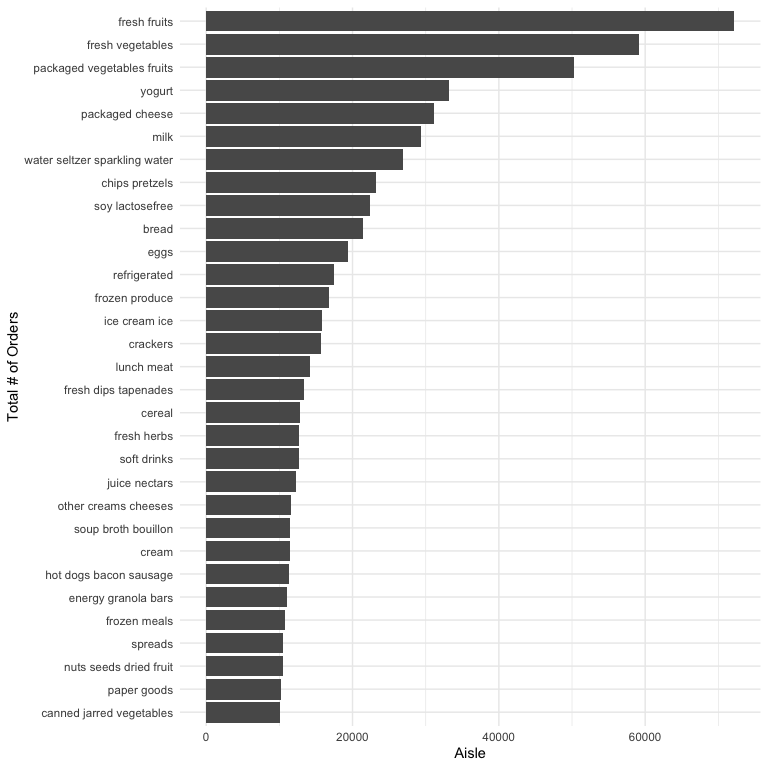

p8105_hw3_sc5826
================
Shivalika Chavan
2025-10-03

``` r
library(tidyverse)
## ── Attaching core tidyverse packages ──────────────────────── tidyverse 2.0.0 ──
## ✔ dplyr     1.1.4     ✔ readr     2.1.5
## ✔ forcats   1.0.0     ✔ stringr   1.5.1
## ✔ ggplot2   3.5.2     ✔ tibble    3.3.0
## ✔ lubridate 1.9.4     ✔ tidyr     1.3.1
## ✔ purrr     1.1.0     
## ── Conflicts ────────────────────────────────────────── tidyverse_conflicts() ──
## ✖ dplyr::filter() masks stats::filter()
## ✖ dplyr::lag()    masks stats::lag()
## ℹ Use the conflicted package (<http://conflicted.r-lib.org/>) to force all conflicts to become errors
library(haven)
library(readxl)
library(p8105.datasets)

knitr::opts_chunk$set(
  fig.width = 6,
  fig.asp = .6,
  out.width = "95%"
)

theme_set(theme_minimal() + theme(legend.position = "bottom"))

options(
  ggplot2.continuous.colour = "viridis",
  ggplot2.continuous.fill = "viridis"
)

scale_colour_discrete = scale_colour_viridis_d
scale_fill_discrete = scale_fill_viridis_d
```

### Problem 1

``` r
data("instacart")
```

``` r
length(unique(pull(instacart, aisle_id)))
## [1] 134
length(unique(pull(instacart, aisle)))
## [1] 134

top_3_ordered_aisles = instacart |> 
  group_by(aisle) |> 
  summarize(num_orders = n_distinct(order_id)) |> 
  mutate(order_rank = min_rank(desc(num_orders))) |> 
  filter(order_rank <= 3) 
```

There are 134 aisles. The 3 aisles with the highest number of orders are
fresh fruits, fresh vegetables, packaged vegetables fruits

``` r
# Plotting 
instacart |> 
  group_by(aisle) |> 
  summarize(num_orders = n_distinct(order_id)) |> 
  filter(num_orders > 10000) |> 
  arrange(num_orders) |> 
  ggplot(aes(x = reorder(aisle, num_orders), y = num_orders)) +
  geom_bar(stat = "identity") +
  coord_flip() +
  labs(
    x = "Total # of Orders",
    y = "Aisle"
  )
```



``` r
instacart |>
  filter(aisle %in% c("baking ingredients", "dog food care", "packaged vegetables fruits")) |> 
  group_by(aisle, product_name) |> 
  summarize(num_orders = n()) |> 
  mutate(order_rank = min_rank(desc(num_orders))) |> 
  filter(order_rank <= 3) |> 
  arrange(desc(num_orders)) |> 
  select(-order_rank) |> 
  knitr::kable()
```

    ## `summarise()` has grouped output by 'aisle'. You can override using the
    ## `.groups` argument.

| aisle | product_name | num_orders |
|:---|:---|---:|
| packaged vegetables fruits | Organic Baby Spinach | 9784 |
| packaged vegetables fruits | Organic Raspberries | 5546 |
| packaged vegetables fruits | Organic Blueberries | 4966 |
| baking ingredients | Light Brown Sugar | 499 |
| baking ingredients | Pure Baking Soda | 387 |
| baking ingredients | Cane Sugar | 336 |
| dog food care | Snack Sticks Chicken & Rice Recipe Dog Treats | 30 |
| dog food care | Organix Chicken & Brown Rice Recipe | 28 |
| dog food care | Small Dog Biscuits | 26 |

``` r
instacart |> 
  filter(product_name %in% c("Pink Lady Apples", "Coffee Ice Cream")) |> 
  group_by(product_name, order_dow) |> 
  summarize(mean_hour_of_day = round(mean(order_hour_of_day), digits = 1)) |> 
  pivot_wider(
    names_from = product_name,
    values_from = mean_hour_of_day
  )|> 
  knitr::kable()
```

    ## `summarise()` has grouped output by 'product_name'. You can override using the
    ## `.groups` argument.

| order_dow | Coffee Ice Cream | Pink Lady Apples |
|----------:|-----------------:|-----------------:|
|         0 |             13.8 |             13.4 |
|         1 |             14.3 |             11.4 |
|         2 |             15.4 |             11.7 |
|         3 |             15.3 |             14.2 |
|         4 |             15.2 |             11.6 |
|         5 |             12.3 |             12.8 |
|         6 |             13.8 |             11.9 |

### Problem 2

### Problem 3
